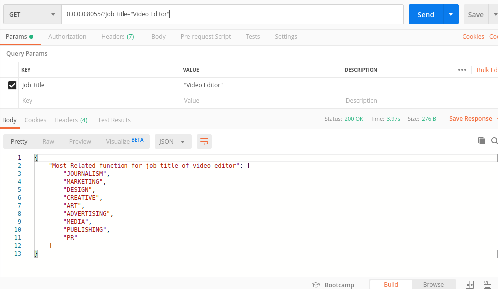
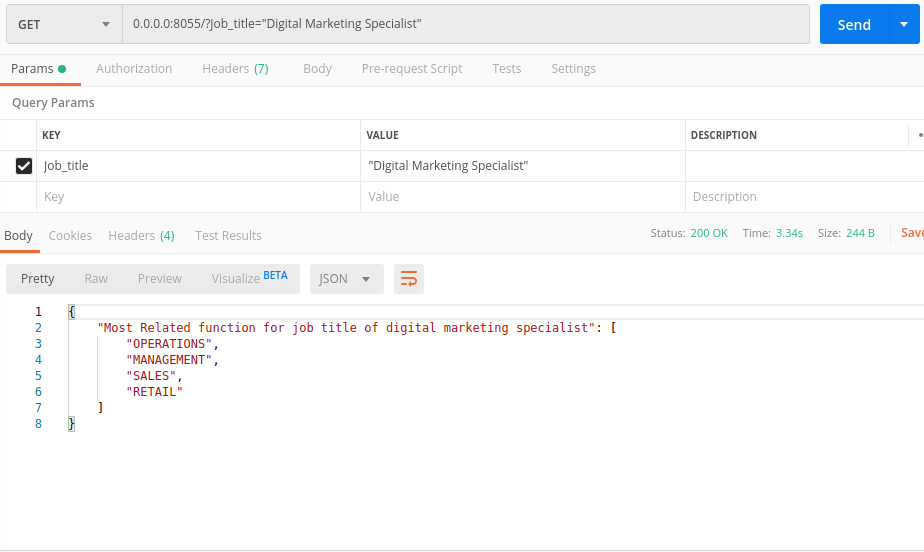
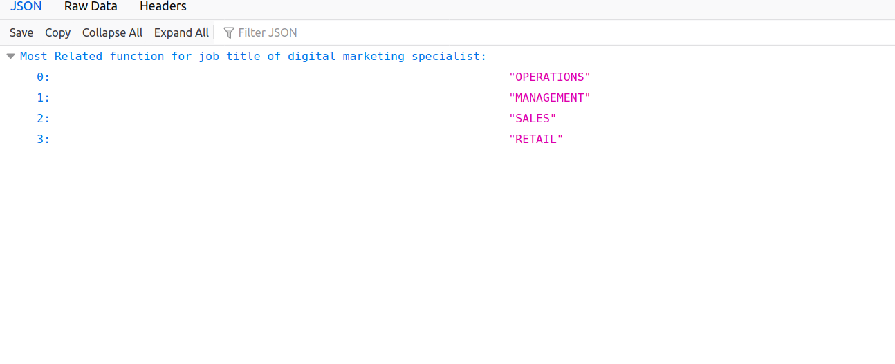

# Recommendation-System
Recommendation System

## This repo related to inet.works internship Task
You can see more detials of this work at iNetworks_ML_Task-Round 2.pdf and more explanation at 03_Report.ipynb

### Description of the problem: 

- Job functions and job titles are very different things.

- A job title is essentially the name of a position within an organization filled by an employee. 

- Job function is the routine set of tasks or activities undertaken by a person in that position. 

- An employee's title and function are often closely related, though not all job functions are clear based on title alone.

### Create this script as aRESTful API service in which:
- the input is a HTTP request with a parameter for the "Job title".

- theoutput is the recommended “jobfunction/s”. 

### Use Flask API to deploy the RESTful API service. 

**Run the file 02_Code.py to see result of work**

## screenshots of soultions

### Returned Function

 - After We have get most relvent job function we use RESTful API along with Flask to display our result like:
 
 
### Our Result of Prediction

**First Image Using Mozila Firefox browser**

    
    
**Second Image Using Psot Man Application**
    

